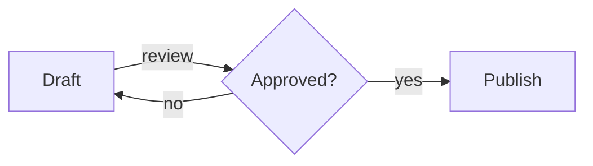
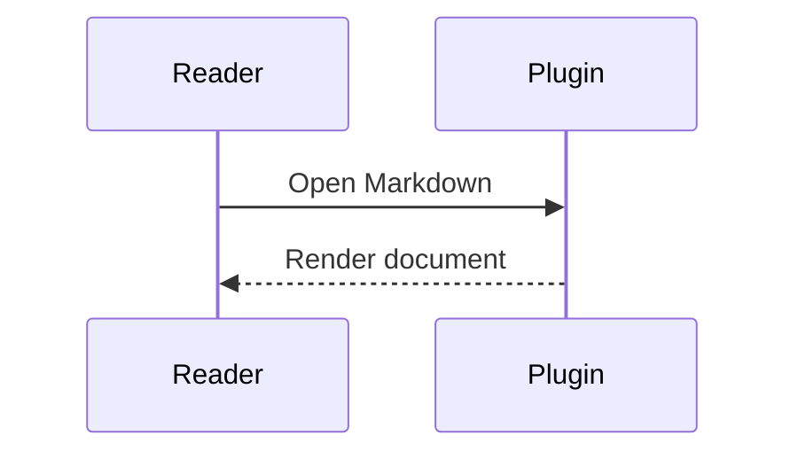

# mdeye.nvim

Read Markdown as a document, inside Neovim.

mdeye.nvim opens a Markdown buffer as a separate, read-only preview. Tree-sitter parses the Markdown. The preview wraps paragraphs to the window, centers a reading column, and removes source markers. Highlight groups follow your colorscheme. The layout follows Zed's native Markdown preview.

- Paragraphs wrap to the window width. Hard wraps in the source disappear.
- The reading column is centered, with equal margins (`min(max_width, width - 2 * min_margin)`).
- Headings have no `#` markers. They have dividers and extra vertical space.
- The preview renders emphasis, strong, strikethrough, inline code, and links with destinations hidden.
- The preview renders lists, task lists, block quotes, GitHub-style alerts, footnotes, thematic breaks, and GitHub-style tables.
- If a language parser is present, fenced code uses Tree-sitter highlights.
- The preview draws native Mermaid shared-node flowcharts, subgraph containers, and sequence diagrams.
- `mmdc` can render Mermaid to PNG. You can open that image.
- Headings and code blocks use folds. Reading position stays across edits and wrap.
- Local images go through `image.nvim`. You configure that plugin separately.
- Updates from unsaved source edits after `debounce_ms` milliseconds without a new edit.
- Window resize wraps the document again and keeps your reading position.
- `<CR>` jumps to the exact source block. Links and document anchors open from the preview.
- You can open a heading outline, move between headings, and copy fenced code from the preview.
- The source buffer is never modified. When you close the preview, the plugin removes it.

## Requirements

- Neovim 0.11 or newer
- The bundled `markdown` and `markdown_inline` Tree-sitter parsers (included with Neovim).

No other runtime dependencies. Fenced code uses matching Tree-sitter language parsers installed in Neovim. If a parser is missing, the fence stays readable as plain text. Run `:checkhealth mdeye`. It reports the Markdown parsers, parsers used by open documents, and the state of the active preview session.

## Installation

With [lazy.nvim](https://github.com/folke/lazy.nvim):

```lua
{
  "makyinmars/mdeye.nvim",
  ft = "markdown",
  opts = {},
}
```

With Neovim's built-in `vim.pack`:

```lua
vim.pack.add({ "https://github.com/makyinmars/mdeye.nvim" })
require("mdeye").setup()
```

## Usage

| Command | Behavior |
| --- | --- |
| `:MDEye` | Toggle a preview in the current window. |
| `:MDEye current` | Open or focus the preview in the current window. |
| `:MDEye split` | Open or focus a synchronized preview in a right split. |
| `:MDEye tab` | Open or focus the preview in a new tab page. |
| `:MDEye close` | Close the preview and restore the source view. |
| `:MDEye copy-code` | Copy the fenced block under the preview or source cursor. |
| `:MDEye open-image` | Open the Mermaid PNG for the fence under the cursor in the OS viewer. |

If the source has unsaved changes, `:MDEye current` requires the `hidden` option. If `hidden` is off, the command fails. You can use `:MDEye split`.

Inside the preview:

| Key | Behavior |
| --- | --- |
| `q` | Close the preview and restore the source view. |
| `<CR>` | Open the link under the cursor, or jump to the block's source location. |
| `gx` | Open the link or in-document anchor under the cursor. |
| `]]` / `[[` | Move to the next or previous heading. |
| `gO` | Select a heading from the document outline. |
| `yc` | Copy the fenced code block under the cursor. |
| `go` | Open the Mermaid PNG for the fence under the cursor in the OS viewer. |
| `za` / `zo` / `zc` | Toggle, open, or close a heading or code fold. |
| `zA` / `zO` / `zC` | Toggle, open, or close a fold and its nested folds. |
| `zR` / `zM` | Open or close all folds. |

In split mode, moving the source cursor scrolls the preview to the matching block. Movement of the preview cursor never moves the source cursor. `<CR>` does that jump.

Split previews are ordinary resizable Neovim windows. If the preview is focused, type `10<C-w>>` to grow it by 10 columns. Type `10<C-w><` to shrink it by 10 columns. If the `mouse` option is on, you can drag the split separator. Enable it with `:set mouse=a`.

The document wraps again after every resize. Your reading position stays. By default, the reading column stops at `max_width`. If you set `max_width = false`, the column follows the full window width.

mdeye installs no global keymaps. This mapping is a suggestion:

```lua
vim.keymap.set("n", "<leader>me", "<Cmd>MDEye<CR>", { desc = "Markdown eye" })
```

The equivalent Lua interface:

```lua
require("mdeye").open({ mode = "current" | "split" | "tab" })
require("mdeye").close()
require("mdeye").toggle({ mode = "current" })
require("mdeye").copy_code()
require("mdeye").open_image()
```

## Configuration

The block that follows shows the defaults. If you change the defaults, call `setup()`.

```lua
require("mdeye").setup({
  open = "current",   -- default placement: "current" | "split" | "tab"
  max_width = 88,     -- maximum reading width; false follows the window width
  min_margin = 3,     -- minimum margin on each side
  debounce_ms = 120,  -- live-update debounce
  mermaid = {
    enabled = true,
    layout = "graph", -- or "connections"
    image = {
      enabled = "auto", -- "auto" | "on" | "off"
      command = nil, -- nil detects `mmdc`; or an executable path
      timeout_ms = 1500,
      theme = "auto", -- "auto" | "default" | "dark"
      background = "transparent",
    },
  },
  images = {
    enabled = false,  -- opt in after configuring image.nvim
    max_width = 60,   -- display cells
    max_height = 16,  -- buffer rows
    max_file_size = 10 * 1024 * 1024,
    max_images = 32,  -- per document
  },
  code = {
    wrap = false,     -- false: horizontal scrolling; true: display-cell wrapping
  },
})
```

You cannot change renderer internals. Change highlight groups to change colors.

## Highlights

Each group uses `default link`. Your colorscheme and your `:highlight` commands always win. No colors are hard-coded.

`MDEyeText`, `MDEyeMuted`, `MDEyeHeading1`–`MDEyeHeading6`, `MDEyeHeadingRule`,
`MDEyeEmphasis`, `MDEyeStrong`, `MDEyeStrike`, `MDEyeCode`, `MDEyeCodeBlock`,
`MDEyeDiagram`, `MDEyeLink`, `MDEyeFootnote`, `MDEyeQuote`, `MDEyeListMarker`,
`MDEyeTableBorder`, `MDEyeTaskChecked`, `MDEyeTaskUnchecked`, `MDEyeAlertNote`,
`MDEyeAlertTip`, `MDEyeAlertImportant`, `MDEyeAlertWarning`, `MDEyeAlertCaution`

Example override:

```lua
vim.api.nvim_set_hl(0, "MDEyeHeading1", { fg = "#c6a0f6", bold = true })
```

## Behavior notes

- The preview buffer is `mdeye://<path>` with `filetype=mdeye`, `buftype=nofile`, and `bufhidden=wipe`. Markdown linters, LSP servers, diagnostics, and formatting autocmds never attach to it.
- Unsaved source edits render from the live buffer. The file on disk is never reread.
- Relative links resolve against the source file directory. They do not resolve against the Neovim working directory. Heading anchors work in the preview and in linked Markdown files. An extmark is a Neovim mark on a range of text. If the terminal supports OSC 8 (a terminal hyperlink protocol), absolute `http(s)` and `mailto` links also carry extmark `url` metadata.
- GFM-style footnote references render as numbered links to formatted definitions. Continuation blocks with standard indent keep Markdown styling, lists, and fenced code. Unresolved references stay visible as `[^label]`.
- GitHub-style `NOTE`, `TIP`, `IMPORTANT`, `WARNING`, and `CAUTION` alerts render with titles for the alert type. Titles and gutters use diagnostic highlight groups. Nested Markdown stays in the alert.
- Fenced code keeps its language label and whitespace. If a Tree-sitter highlight query exists for the language, the fence uses it. If no query exists, the code stays readable as plain text. By default, over-wide code lines scroll horizontally. If `code.wrap` is true, over-wide code lines wrap. Tables shrink and wrap cells.
- Unsupported raw HTML renders as readable plain text. Nothing is executed.
- When you close the preview, it removes its buffer, window, autocmds, mappings, and timers.

## Mermaid diagrams

Fences labeled `mermaid` render native ASCII for common flowchart connections:



The default `graph` layout draws each node once. Edges use separate right-angle lanes. Numbered source ports match a legend for labels. An `x` marks a crossing, not a junction. Subgraphs have visible containers, including nested groups.

If `LR` or `RL` diagrams fit, they place nodes in a horizontal row. If they do not fit, they stack. `TD`, `TB`, and `BT` diagrams stack vertically. Node order follows the source declarations and the diagram direction. It does not follow the Mermaid browser layout.

If a graph cannot fit, ungrouped flowcharts use the compact connection view. To use that view for every graph, set `mermaid.layout = "connections"`. If a subgraph cannot fit, the preview keeps the source. Grouping is never discarded without a reason.

Supported flowchart syntax:

- `flowchart` or `graph`, with `LR`, `RL`, `TD`, `TB`, or `BT` direction.
- ASCII node IDs that start with a letter or underscore, then letters, digits, or underscores.
- Plain nodes, `[rectangle]`, `(rounded)`, `([stadium])`, `((circle))`, `[[subroutine]]`, and `{decision}` labels.
- Shapes use approximate ASCII borders.
- `-->`, `---`, `-.->`, `==>`, chains, `-->|label|`, and `-- label -->` connections.
- `subgraph id[Title]` / `end`, with up to eight nested groups.
- Edges must name nodes. Group-level edges and local subgraph direction overrides keep the source.
- Statements separated by a newline or a semicolon, and `%%` comments.
- Single-line quoted labels, later label updates, isolated nodes, branches, parallel edges, and cycles.

Sequence diagrams support:

- `participant` and `actor` declarations, with `as` aliases.
- Messages: `->>`, `-->>`, `->`, `-->`, `-x`, `--x`, `-)`, `--)`.
- Self-calls, `autonumber`, `activate`/`deactivate`, and message suffixes (`+`/`-`).
- `Note over`, `Note left of`, and `Note right of`.
- Nested `loop`, `alt`/`else`, `opt`, and `par`/`and` regions.

Arrow styles use approximate ASCII. `#` marks an active lifeline. Use one sequence statement per line.



The preview keeps the entire fence as source with a reason for:

- Other diagram types.
- Styling and initialization directives.
- Click actions, HTML, entities, and Markdown labels.
- Unsupported or incomplete syntax.

Limits: 100 flowchart nodes, 200 edges or events, 20 sequence participants, 500 source lines, and 64 KiB per fence. If a sequence is too wide for the window, the preview shows source. See the official [flowchart](https://mermaid.js.org/syntax/flowchart.html) and [sequence](https://mermaid.js.org/syntax/sequenceDiagram.html) syntax references.

`yc` and `:MDEye copy-code` always copy original Mermaid text. If the cursor is on the `open image` link, `<CR>` opens that image. If the cursor is not on that link, `<CR>` jumps to the source fence. Set `mermaid.enabled = false` to show source for every diagram. `MDEyeDiagram` controls diagram text highlights.

### Mermaid as images

If `mermaid.image.enabled` is `"auto"` (the default) or `"on"`, and [mermaid-cli](https://github.com/mermaid-js/mermaid-cli) (`mmdc`) is on `PATH`, fences render to a cached PNG. Pie charts, styled flowcharts, and other syntax that native ASCII rejects then become PNG diagrams.

```sh
npm install -g @mermaid-js/mermaid-cli
```

If a PNG exists, the preview shows `mermaid (image)` and an `open image` link. `go` or `:MDEye open-image` opens that file in the OS viewer. Inline graphics require `images.enabled = true` and image.nvim. If inline display is not available, the PNG still opens with `go`.

The preview uses a ready PNG first. If there is no PNG, it uses native ASCII. If ASCII cannot render, it shows the original source with a reason. PNG rendering runs in the background. The first paint never waits on Chromium.

To keep ASCII only, set `mermaid.image.enabled = "off"`.

## Reading position and folds

A fold is a collapsible region. Heading sections and fenced code use native manual folds. Folds start open. Standard `za`, `zo`, `zc`, `zA`, `zO`, `zC`, `zR`, and `zM` work inside the preview.

Fold choices for source blocks that still exist stay through live updates and resize. Nested closed folds stay closed. Heading navigation and anchor links open enclosing folds so that the target is visible.

Reading position tracks source edits and a text passage inside each block. It does not jump to the start of the block. If a diagram node or event is still visible, the reading position keeps it. When you close the preview, it discards fold choices and source tracking marks.

## Optional local images

Configure [image.nvim](https://github.com/3rd/image.nvim#configuration) separately, then enable images:

```lua
require("mdeye").setup({ images = { enabled = true } })
```

A standalone image paragraph such as `` reserves real buffer rows below its linked alt text. Paths resolve relative to the Markdown file. Unnamed buffers use the working directory. Quotes and list items can contain image paragraphs. Inline images in prose and remote URLs stay as linked alt text. The plugin does not download remote images.

The adapter:

- Caches handles.
- Limits dimensions and file size.
- Refreshes on scroll, resize, and fold.
- Clears images on removal or preview close.

If the file is missing, the backend is off, or render fails, the preview keeps the alt text. Row reservation uses a 1:2 cell aspect estimate. The backend fits the image inside those bounds. The adapter adds no virtual padding.

| Environment | Text | Local standalone images |
| --- | --- | --- |
| Any terminal or GUI, default configuration | Yes | Linked alt text |
| Configured image.nvim and compatible backend, images enabled | Yes | Optional rendering |
| Other image plugins, including snacks.image | Yes | Linked alt text |

The core text reader loads no image library by default. Image rendering requires the backend and processor dependencies described by image.nvim. `:checkhealth mdeye` reports adapter availability and active image failures. Clickable terminal hyperlinks require OSC 8. `gx` works in every terminal.

## Terminal-grid limitations

Neovim draws on a character-cell grid. mdeye reproduces Zed's document structure and layout. It does not reproduce Zed typography. A terminal cannot provide:

- Proportional fonts or per-heading font sizes.
- Pixel-level line height, kerning, or margins.
- Browser-quality table layout.
- Portable inline raster images without an optional compatible backend.
- Guaranteed bold or italic faces. That depends on your terminal and font.

## Performance

Measured with `nvim --headless -l tests/bench/bench.lua` on an Apple Silicon development machine (Neovim 0.12.2). The table shows full parse, layout, and render of a representative document. Values are the median of 5 runs:

| Fixture | Preview lines | Parse | Layout | Render | Total |
| --- | --- | --- | --- | --- | --- |
| 1,010 lines | 1,156 | 29 ms | 46 ms | 2.0 ms | 76 ms |
| 9,998 lines | 11,428 | 281 ms | 440 ms | 37 ms | 764 ms |

These historical initial-render figures include Tree-sitter highlighting for every Lua fence. Live updates keep unchanged buffer ranges and extmarks. Parsing and layout still process the whole document. This is not an incremental Markdown parser.

A local Neovim 0.12.5 editing benchmark used 10,000 source lines and 15,000 preview lines. The buffer-update stage measured 7.26 ms incremental vs 27.26 ms full. Those values are medians of five edits after warmup.

One paragraph edit replaced one line and created two marks. Parse plus layout plus incremental apply measured 283.51 ms. These pipeline measurements exclude session fold and anchor work. Reproduce with `tests/bench/updates.lua`.

## Development

```sh
# Run all tests (headless, no plugin manager needed)
nvim --headless -l tests/run.lua

# Run one spec
nvim --headless -l tests/run.lua tests/session_spec.lua

# Formatting
stylua --check lua plugin tests

# Benchmarks
nvim --headless -l tests/bench/bench.lua
nvim --headless -l tests/bench/mermaid.lua
nvim --headless -l tests/bench/updates.lua

# Render the comprehensive fixture to stdout at a given width
nvim --headless -l tests/spike/render_demo.lua 100
```

See [implementation evidence and current limits](docs/reader-improvements.md). Architecture notes are in [docs/architecture.md](docs/architecture.md).

The test suite includes reviewed terminal-layout snapshots at 30 and 80 columns. To regenerate them, run `nvim --headless -l tests/spike/update_snapshots.lua`. Inspect the diffs before you accept a visual change.

Design documentation is in [docs/implementation-plan.md](docs/implementation-plan.md). Tree-sitter research evidence is in [docs/milestone-0-evidence.md](docs/milestone-0-evidence.md).
