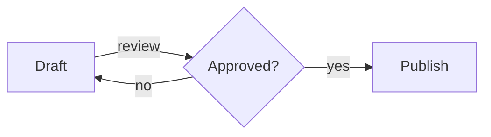
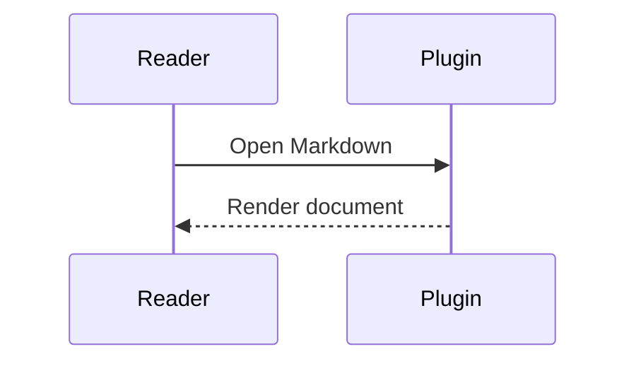

# mdeye.nvim

Read Markdown as a document, inside Neovim.

mdeye.nvim opens a Markdown buffer as a separate, read-only document view — not decorated
source, not a browser. It parses the document with Tree-sitter, reflows paragraphs
semantically, centers a maximum-width reading column, removes source markers, and applies
theme-friendly highlights, in the spirit of Zed's native Markdown preview.

- Paragraphs reflow to the window width; source hard wraps disappear.
- A centered reading column with symmetric margins (`min(max_width, width - 2 * min_margin)`).
- Headings without `#` markers, with dividers and deliberate vertical rhythm.
- Emphasis, strong, strikethrough, inline code, links (destinations hidden), lists,
  task lists, block quotes, GitHub-style alerts, syntax-highlighted fenced code, footnotes,
  thematic breaks, and GitHub-style tables.
- Native Mermaid shared-node flowcharts, subgraph containers, and sequence diagrams.
- Collapsible sections and code blocks; reading positions survive edits and reflow.
- Optional local images through an independently configured `image.nvim` backend.
- Live, debounced updates from unsaved source edits; reflow on window resize that keeps
  your reading position.
- Jump back to the exact source block with `<CR>`; follow links and document anchors.
- Browse a heading outline, move between headings, and copy fenced code without leaving the reader.
- The source buffer is never modified. The preview cleans up completely on close.

## Requirements

- Neovim **0.11+**
- The bundled `markdown` and `markdown_inline` Tree-sitter parsers (included with Neovim)

No other runtime dependencies. Fenced code uses any matching Tree-sitter language parsers already
installed in Neovim and falls back to readable plain text when one is unavailable. Run
`:checkhealth mdeye` to verify the Markdown parsers, parsers used by open documents, and active
preview session state.

## Installation

With [lazy.nvim](https://github.com/folke/lazy.nvim):

```lua
{
  "makyinmars/mdeye.nvim",
  ft = "markdown",
  opts = {},
}
```

With Neovim's built-in `vim.pack`:

```lua
vim.pack.add({ "https://github.com/makyinmars/mdeye.nvim" })
require("mdeye").setup()
```

## Usage

| Command | Behavior |
| --- | --- |
| `:MDEye` | Toggle a preview in the current window. |
| `:MDEye current` | Open or focus the preview in the current window. |
| `:MDEye split` | Open or focus a synchronized preview in a right split. |
| `:MDEye tab` | Open or focus the preview in a new tab page. |
| `:MDEye close` | Close the preview and restore the source view. |
| `:MDEye copy-code` | Copy the fenced block under the preview or source cursor. |

Inside the preview:

| Key | Behavior |
| --- | --- |
| `q` | Close the preview and restore the source view. |
| `<CR>` | Open the link under the cursor, or jump to the block's source location. |
| `gx` | Open the link or in-document anchor under the cursor. |
| `]]` / `[[` | Move to the next/previous heading. |
| `gO` | Select a heading from the document outline. |
| `yc` | Copy the fenced code block under the cursor. |
| `za` / `zo` / `zc` | Toggle/open/close a heading or code fold. |
| `zR` / `zM` | Open/close all folds. |

In split mode, moving the source cursor scrolls the preview to the corresponding block.
Preview cursor movement never moves the source cursor; `<CR>` performs that jump
explicitly.

Split previews are ordinary resizable Neovim windows. With the preview focused, use
`10<C-w>>` to grow it by 10 columns or `10<C-w><` to shrink it. You can also drag the
split separator when Neovim's `mouse` option is enabled (for example, `:set mouse=a`).
The document reflows after every resize without losing your reading position. The reading
column stops growing at `max_width` by default; set `max_width = false` to make it follow
the full pane width.

mdeye installs no global keymaps. A suggested mapping:

```lua
vim.keymap.set("n", "<leader>me", "<Cmd>MDEye<CR>", { desc = "Markdown eye" })
```

The equivalent Lua interface:

```lua
require("mdeye").open({ mode = "current" | "split" | "tab" })
require("mdeye").close()
require("mdeye").toggle({ mode = "current" })
require("mdeye").copy_code()
```

## Configuration

Defaults shown; calling `setup()` is optional unless you change them.

```lua
require("mdeye").setup({
  open = "current",   -- default placement: "current" | "split" | "tab"
  max_width = 88,     -- maximum reading width; false follows the window width
  min_margin = 3,     -- minimum margin on each side
  debounce_ms = 120,  -- live-update debounce
  mermaid = { enabled = true, layout = "graph" }, -- or "connections"
  images = {
    enabled = false,  -- opt in after configuring image.nvim
    max_width = 60,   -- display cells
    max_height = 16,  -- buffer rows
    max_file_size = 10 * 1024 * 1024,
    max_images = 32,  -- per document
  },
  code = {
    wrap = false,     -- false: horizontal scrolling; true: display-cell wrapping
  },
})
```

Renderer internals are deliberately not configurable. Highlight groups are the
customization seam.

## Highlights

Every group uses `default link` semantics, so your colorscheme and explicit
`:highlight` commands always win. No colors are hard-coded.

`MDEyeText`, `MDEyeMuted`, `MDEyeHeading1`–`MDEyeHeading6`, `MDEyeHeadingRule`,
`MDEyeEmphasis`, `MDEyeStrong`, `MDEyeStrike`, `MDEyeCode`, `MDEyeCodeBlock`,
`MDEyeDiagram`, `MDEyeLink`, `MDEyeFootnote`, `MDEyeQuote`, `MDEyeListMarker`,
`MDEyeTableBorder`, `MDEyeTaskChecked`, `MDEyeTaskUnchecked`, `MDEyeAlertNote`,
`MDEyeAlertTip`, `MDEyeAlertImportant`, `MDEyeAlertWarning`, `MDEyeAlertCaution`

Example override:

```lua
vim.api.nvim_set_hl(0, "MDEyeHeading1", { fg = "#c6a0f6", bold = true })
```

## Behavior notes

- The preview buffer is `mdeye://<path>` with `filetype=mdeye`, `buftype=nofile`, and
  `bufhidden=wipe`. Markdown linters, LSP servers, diagnostics, and formatting autocmds
  never attach to it.
- Unsaved source edits are rendered from the live buffer; the file on disk is never
  reread.
- Relative links resolve against the source file's directory, not Neovim's working
  directory. Heading anchors work within the preview and in linked Markdown files.
  Absolute `http(s)`/`mailto` links also carry OSC 8 extmark `url` metadata where the
  terminal supports it.
- GFM-style footnote references render as numbered links to cleanly formatted definitions.
  Standard indented continuation blocks retain Markdown styling, lists, and fenced code;
  unresolved references remain visible as source-shaped text.
- GitHub-style `NOTE`, `TIP`, `IMPORTANT`, `WARNING`, and `CAUTION` alerts render with semantic
  titles and theme-controlled diagnostic colors while preserving nested Markdown content.
- Fenced code keeps its language label and whitespace, uses the language's Tree-sitter
  highlight query when available, and otherwise stays readable as plain text. Over-wide
  code lines scroll horizontally by default or wrap when `code.wrap` is true; tables shrink
  and wrap cells instead.
- Unsupported raw HTML renders as readable plain text; nothing is executed.

## Mermaid diagrams

Fences labeled `mermaid` render a portable text view of common flowchart connections:



The default `graph` layout draws each node once. Edges use separate orthogonal
lanes, with numbered source ports and a legend for labels. An `x` marks a crossing,
not a junction. Subgraphs have visible containers, including nested groups.
`LR`/`RL` diagrams arrange nodes horizontally when they fit; otherwise they stack.
`TD`/`TB`/`BT` diagrams stack vertically. Ordering follows declarations and direction,
rather than Mermaid's browser layout algorithm.

When a graph cannot fit, ungrouped flowcharts use the compact connection view.
Set `mermaid.layout = "connections"` to select that view explicitly. Subgraphs
that cannot fit retain their source, so grouping is never silently discarded.

Supported flowchart syntax:

- `flowchart` or `graph`, with `LR`, `RL`, `TD`, `TB`, or `BT` direction.
- ASCII node IDs starting with a letter or underscore, followed by letters, digits, or underscores.
- Plain nodes, `[rectangle]`, `(rounded)`, `([stadium])`, `((circle))`, `[[subroutine]]`,
  and `{decision}` labels. Shapes use approximate ASCII borders.
- `-->`, `---`, `-.->`, `==>`, chains, `-->|label|`, and `-- label -->` connections.
- `subgraph id[Title]` / `end`, with up to eight nested groups. Edges must name nodes;
  group-level edges and local subgraph direction overrides retain source.
- Newline/semicolon-separated statements, `%%` comments, single-line quoted labels,
  later label updates, isolated nodes, branches, parallel edges, and cycles.

Sequence diagrams support `participant`/`actor` declarations, `as` aliases,
messages (`->>`, `-->>`, `->`, `-->`, `-x`, `--x`, `-)`, `--)`), self-calls,
`autonumber`, `activate`/`deactivate`, and message activation suffixes (`+`/`-`).
`Note over`, `Note left of`, `Note right of`, and nested `loop`, `alt`/`else`,
`opt`, and `par`/`and` regions are supported. Arrow styles are approximated with
ASCII; `#` marks an active lifeline. Use one sequence statement per line.



Other diagram types, styling, initialization directives, click actions, HTML/entities,
Markdown labels, and unsupported or incomplete syntax keep the entire fence as source
with a reason. Limits: 100 flowchart nodes, 200 edges/events, 20 sequence participants,
500 source lines, and 64 KiB per fence. A sequence too wide for the pane also shows source.
See the official [flowchart](https://mermaid.js.org/syntax/flowchart.html) and
[sequence](https://mermaid.js.org/syntax/sequenceDiagram.html) syntax references.

`yc` / `:MDEye copy-code` always copies original Mermaid text; `<CR>` jumps to the
source fence. Set `mermaid.enabled = false` to show source for every diagram.
`MDEyeDiagram` controls diagram text highlights.

## Reading position and folds

Heading sections and fenced code are native manual folds, initially open. Standard
`za`, `zo`, `zc`, `zA`, `zO`, `zC`, `zR`, and `zM` work inside the preview. Nested
fold choices survive live updates and resizing for retained source blocks. Heading
navigation and anchor links open enclosing folds to reveal their target.

Reading anchors track source edits and a text passage within each block, rather than
jumping to the block's beginning. Diagram anchors retain the visible node or event
when possible. Closing the preview discards its fold choices and source tracking marks.

## Optional local images

Configure [image.nvim](https://github.com/3rd/image.nvim#configuration) separately, then opt in:

```lua
require("mdeye").setup({ images = { enabled = true } })
```

A standalone image paragraph such as `` reserves real buffer
rows below its linked alt text. Paths resolve relative to the Markdown file; unnamed
buffers use the working directory. Quotes and list items can contain image paragraphs.
Inline images within prose and remote URLs remain linked alt text.

The adapter caches handles, bounds dimensions and file size, refreshes on scrolling,
resizing, and folding, and clears images on removal or preview close. Missing files,
disabled/unavailable backends, and decode/render errors retain alt text. The row
reservation uses a conventional 1:2 cell aspect estimate; the backend fits the image
inside those bounds. No virtual padding is added by the adapter.

| Environment | Text | Local standalone images |
| --- | --- | --- |
| Any terminal or GUI, default configuration | Yes | Linked alt text |
| Configured image.nvim and compatible backend, images enabled | Yes | Optional rendering |
| Other image plugins, including snacks.image | Yes | Linked alt text |

The core text reader loads no image library by default. Image rendering requires the
backend and processor dependencies described by image.nvim. `:checkhealth mdeye`
reports adapter availability and active image failures. Terminal hyperlinks depend
on OSC 8 support; `gx` remains available everywhere.

## Terminal-grid limitations

Neovim draws on a character-cell grid, so mdeye reproduces Zed's document *structure and
layout*, not its typography. Not possible in a terminal:

- proportional fonts or per-heading font sizes;
- pixel-level line height, kerning, or margins;
- browser-quality table layout;
- portable inline raster images without an optional compatible backend;
- guaranteed bold/italic faces — that depends on your terminal and font.

## Performance

Measured with `nvim --headless -l tests/bench/bench.lua` on an Apple Silicon
development machine (Neovim 0.12.2), full parse + layout + render of a representative
document, median of 5 runs:

| Fixture | Preview lines | Parse | Layout | Render | Total |
| --- | --- | --- | --- | --- | --- |
| 1,010 lines | 1,156 | 29 ms | 46 ms | 2.0 ms | **76 ms** |
| 9,998 lines | 11,428 | 281 ms | 440 ms | 37 ms | **764 ms** |

These historical initial-render figures include Tree-sitter highlighting for every Lua
fence. Live updates now retain unchanged buffer ranges and extmarks. Parsing and layout
still process the whole document; this is not an incremental Markdown parser.

A local Neovim 0.12.5 editing benchmark with 10,000 source lines and 15,000 preview
lines measured the buffer-update stage at **7.26 ms incremental vs 27.26 ms full**
(medians of five edits after warmup). One paragraph edit replaced one line and created
two marks. Parse + layout + incremental apply measured 283.51 ms; these pipeline
measurements exclude session fold/anchor work. Reproduce with `tests/bench/updates.lua`.

## Development

```sh
# Run all tests (headless, no plugin manager needed)
nvim --headless -l tests/run.lua

# Run one spec
nvim --headless -l tests/run.lua tests/session_spec.lua

# Formatting
stylua --check lua plugin tests

# Benchmarks
nvim --headless -l tests/bench/bench.lua
nvim --headless -l tests/bench/mermaid.lua
nvim --headless -l tests/bench/updates.lua

# Render the comprehensive fixture to stdout at a given width
nvim --headless -l tests/spike/render_demo.lua 100
```

See [implementation evidence and current limits](docs/reader-improvements.md).

The test suite includes reviewed terminal-layout snapshots at 30 and 80 columns.
Regenerate them explicitly with `nvim --headless -l tests/spike/update_snapshots.lua`,
then inspect the diffs before accepting a visual change.

Design documentation lives in [docs/implementation-plan.md](docs/implementation-plan.md);
the Tree-sitter research evidence is in [docs/milestone-0-evidence.md](docs/milestone-0-evidence.md).
