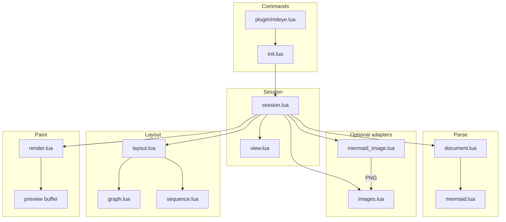
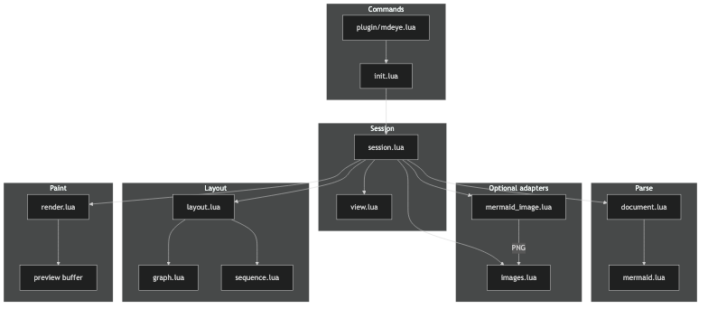
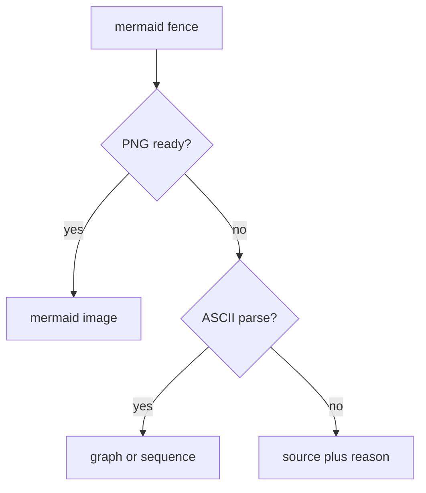
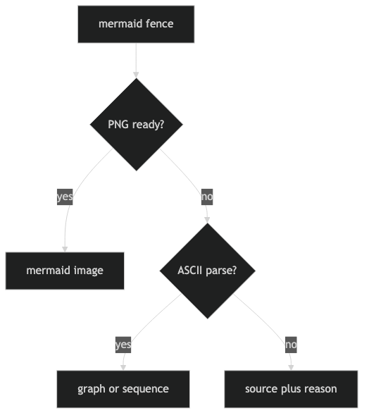
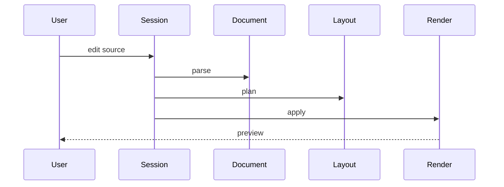
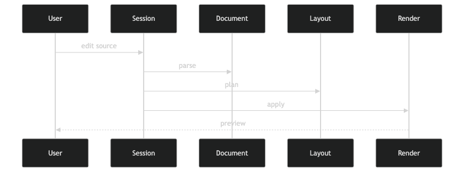

# mdeye.nvim architecture

mdeye opens a Markdown buffer as a separate read-only document view. Tree-sitter
access stays in `document.lua`. The public API stays in `init.lua`. Everything
else is parse, layout, render, or an optional adapter.

## Pipeline

Source never becomes the preview. A session owns one preview buffer, parses a
semantic document, lays out a width-aware plan, and paints that plan.

- `document.lua` turns the source buffer into blocks, inlines, and source spans.
- `mermaid.lua` parses a conservative flowchart/sequence subset beside the original fence.
- `mermaid_image.lua` optionally shells out to `mmdc` and caches a PNG.
- `layout.lua` builds the preview lines. Ready PNGs reserve image cells; otherwise native ASCII from `graph.lua` / `sequence.lua`; otherwise the original source.
- `render.lua` writes the plan into the preview buffer.
- `view.lua` keeps reading anchors and folds across live updates.

## Mermaid fallback

`yc` always copies the original fence text. `go` opens a ready PNG in the OS
viewer. Inline graphics still need `images.enabled` and image.nvim.

## Live update

Edits are debounced. A finished mermaid PNG schedules another plan without
blocking the first paint.
