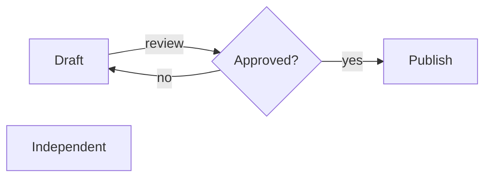
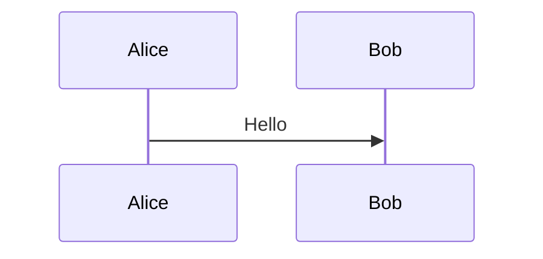
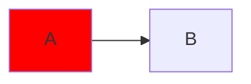

# Mermaid flowcharts

## Review cycle



## Direction and Unicode

> ```mermaid
> graph BT
> A["日本語 café"] -.->|retry| B((Ready))
> ```

## Unsupported diagrams retain source



## Styling retains the entire source


