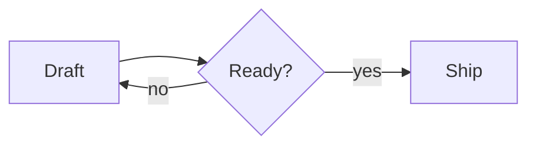
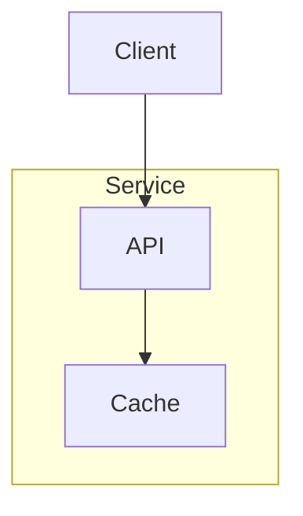
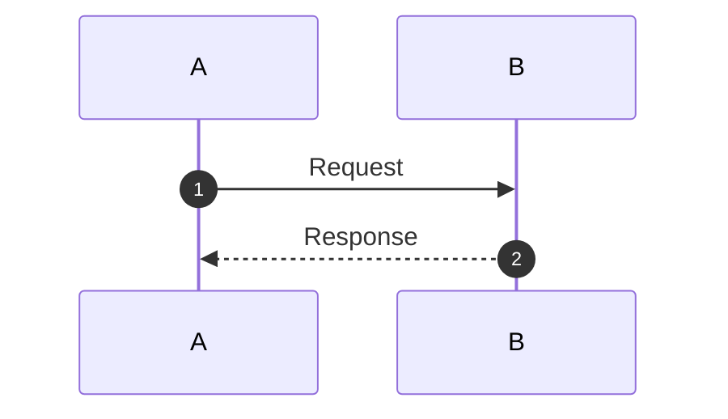

# Reading preview

A paragraph with **strong text**, *emphasis*, and 日本語 café é that wraps across the reading column.

## Lists and tables

- Parent item
  - Nested content with `inline code`.
- [x] Finished

| Name | Value |
| :--- | ---: |
| 日本語 | 42 |
| Longer label | café |

> A quotation with a [link](https://example.com).

## Branch and cycle



## Subgraphs



## Sequence



## Code

```lua
local answer = 42
print(answer)
```
